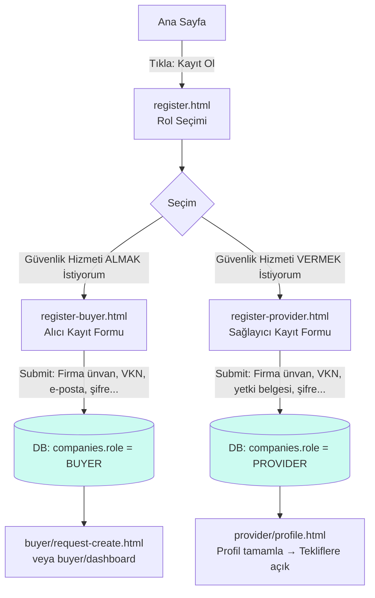
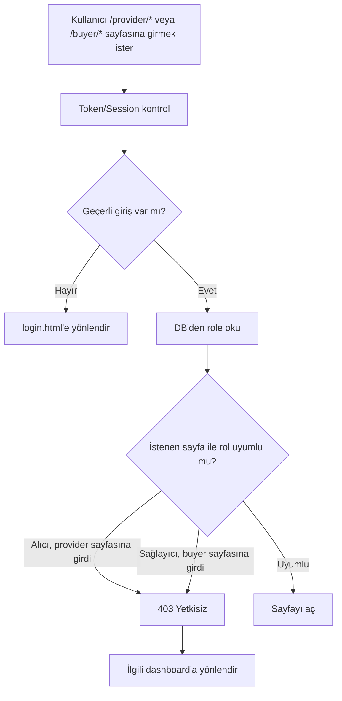
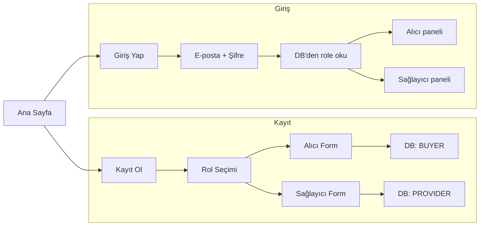

# Kayıt Ol ve Giriş Yap — Akış grafikleri

Aşağıdaki diyagramlar **Kayıt Ol** ve **Giriş Yap** butonlarının akışını gösterir. GitHub veya Mermaid destekleyen editörde grafik olarak görünür. Tarayıcıda açmak için: **akış-grafik.html**

---

## 1. Kayıt Ol butonu akışı



**Kritik nokta:** Rol seçimi veritabanına yazılır: `role = BUYER` veya `role = PROVIDER`.

---

## 2. Giriş Yap butonu akışı

```mermaid
flowchart TD
    A[Ana Sayfa] -->|Tıkla: Giriş Yap| B[login.html<br/>E-posta + Şifre]
    B -->|Submit| C{Auth kontrol}
    C -->|Başarısız| D[Hata: E-posta veya şifre yanlış]
    C -->|Başarılı| E[DB'den kullanıcıyı bul]
    E --> F[role oku: BUYER mı PROVIDER mı?]
    F --> G{role}
    G -->|role = BUYER| H[/buyer/dashboard<br/>Alıcı paneli]
    G -->|role = PROVIDER| I[/provider/dashboard<br/>Sağlayıcı paneli]

    H --> J[Talep oluştur · Açık talepler · Gelen teklifler]
    I --> K[Uygun talepler · Teklif ver · Profil]

    style F fill:#fef3c7
    style G fill:#fef3c7
```

**Kritik nokta:** Girişte rol yeniden seçilmez; sistem DB'den okur ve otomatik yönlendirir.

---

## 3. Yetki kontrolü (URL ile kaçak giriş engeli)



**Özet:** Alıcı token ile sağlayıcı sayfalarına erişemez; sağlayıcı alıcı sayfalarına erişemez. API'da zorunlu.

---

## 4. Tek sayfada özet akış



---

## 5. Admin butonu akışı

```mermaid
flowchart TD
    A[Ana Sayfa / Header] -->|Admin tıkla| B[admin/login.html]
    B --> C[Admin E-posta + Şifre]
    C -->|Submit| D{Auth kontrol}
    D -->|Başarısız| E[Hata: yetkisiz / yanlış giriş]
    D -->|Başarılı| F[DB: user.role = ADMIN ?]
    F -->|Hayır| G[403 Yetkisiz]
    G --> H[Ana sayfaya veya normal dashboard]
    F -->|Evet| I[admin/dashboard]
    I --> J[Alıcı firmalar]
    I --> K[Sağlayıcı firmalar]
    I --> L[Talepler]
    I --> M[Teklifler]
    J --> N[/admin/buyers Liste + filtre]
    N --> O[Satır tıkla → Detay / Pasife al]
    K --> P[/admin/providers Liste + filtre]
    P --> Q[Satır tıkla → Detay / Onayla / Pasife al]

    style F fill:#fef3c7
    style I fill:#ccfbf1
```

**Kural:** Admin paneline giriş için kullanıcıda `role = ADMIN` (veya `is_admin`) olmalı. Admin butonu herkese açık değildir; kalite ve güvenlik için ayrı giriş.

---

*Bu grafikler docs/AKIS-GRAFIK.md içindedir. Tarayıcıda görüntülemek için proje kökündeki akış-grafik.html dosyasını açın.*
